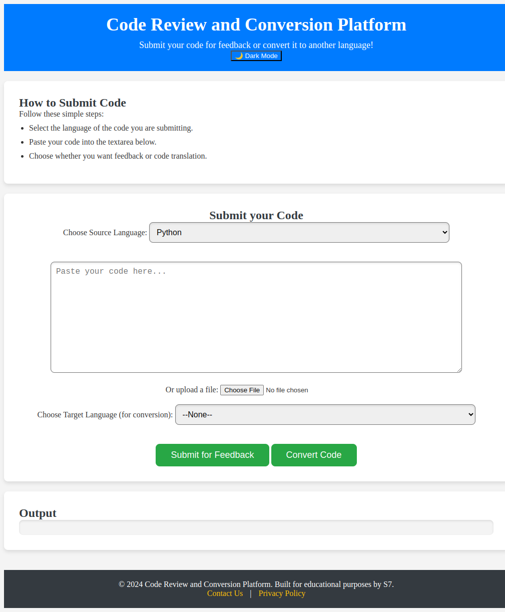
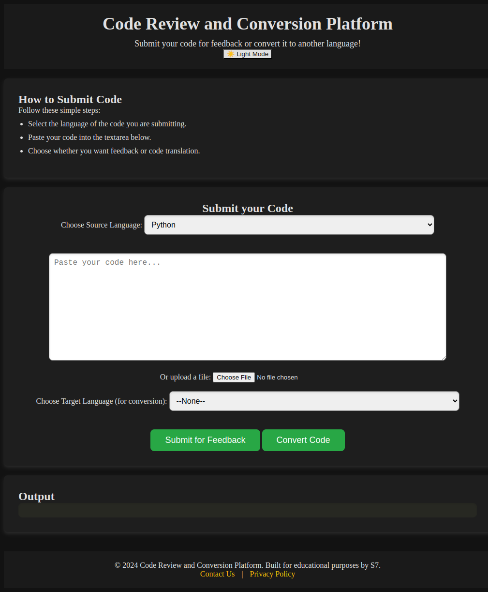
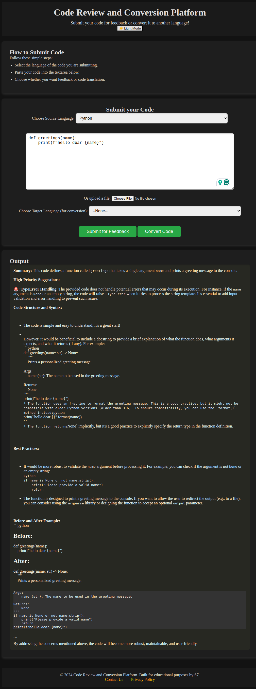
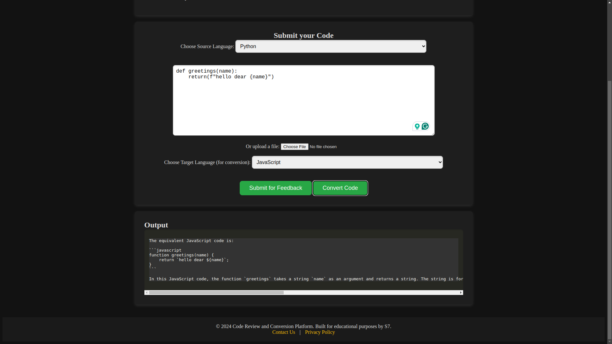

# 🌟 Code Review Platform 🌟

## 🚀 Overview
Welcome to the **Code Review Platform**! This web application allows users to submit their code for instant feedback and translation using two powerful AI APIs: **Llama3 Groq** for detailed code reviews and **OpenAI's ChatGPT-3.5 Turbo** for translating code between programming languages. 

Whether you're a student learning to code or a developer looking to improve your skills, this platform is designed to provide valuable insights and assistance with your code. 

## 🔧 Features
- **Instant Code Feedback:** Get actionable suggestions and improvements for your code based on best practices.
- **Code Translation:** Convert code from one programming language to another effortlessly.
- **User-Friendly Interface:** Easy-to-navigate design to enhance user experience.
- **Dark Mode:** Switch between light and dark themes for comfortable viewing.

## 📦 Technologies Used
- **Llama3 Groq** for code reviews
- **OpenAI's ChatGPT-3.5 Turbo** for code translation
- **Flask** for the backend server
- **HTML/CSS** and **JavaScript** for the frontend

## ⚙️ Installation & Running the Project

### Prerequisites
- Python 3.7 or higher
- pip (Python package installer)
- An API key for both **Llama3 Groq** and **OpenAI**

### Step 1: Clone the Repository
```bash
git clone https://github.com/yourusername/code-review-platform.git
cd code-review-platform
```

### Step 2: Set Up a Virtual Environment (Optional)
It’s a good practice to create a virtual environment to manage dependencies.
```bash
python -m venv venv
source venv/bin/activate  # On Windows use `venv\Scripts\activate`
```

### Step 3: Install Dependencies
Install the required Python packages using pip:
```bash
pip install -r requirements.txt
```

### Step 4: Configure Environment Variables
Create a `.env` file in the project root and add your API keys:
```
GROQ_API_KEY=your_groq_api_key
OPENAI_API_KEY=your_openai_api_key
```

### Step 5: Run the Application
Start the Flask server:
```bash
python app.py
```

### Step 6: Access the Application
Open your web browser and navigate to:
```
http://127.0.0.1:5000
```

## 🤔 How to Use
1. **Select the Language:** Choose the programming language of the code you are submitting.
2. **Paste Your Code:** Either paste your code in the provided textarea or upload a code file.
3. **Submit:** Click the "Submit Code" button to receive feedback and translated code.
4. **Receive Feedback:** Review the detailed feedback generated by Groq and the translated code from OpenAI.

## Light/Dark Mode Preview

<table>
  <tr>
    <td></td>
    <td></td>
  </tr>
  <tr>
    <td align="center">Light Mode</td>
    <td align="center">Dark Mode</td>
  </tr>
</table>


## Example screenshots for feedback of code


## Example screenshots for translating the code to different language


## 🎉 Contributing
Contributions are welcome! If you have suggestions for improvements or new features, feel free to create an issue or submit a pull request.

## 📄 License
This project is licensed under the MIT License - see the [LICENSE](LICENSE) file for details.

## 📝 Acknowledgements
- Special thanks to the **Llama3 Groq** and **OpenAI** teams for their amazing APIs that power this application!